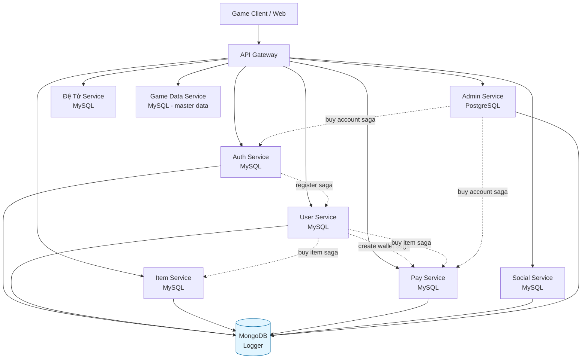
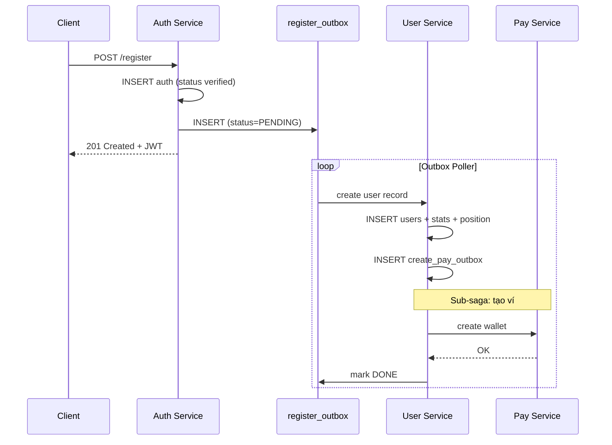
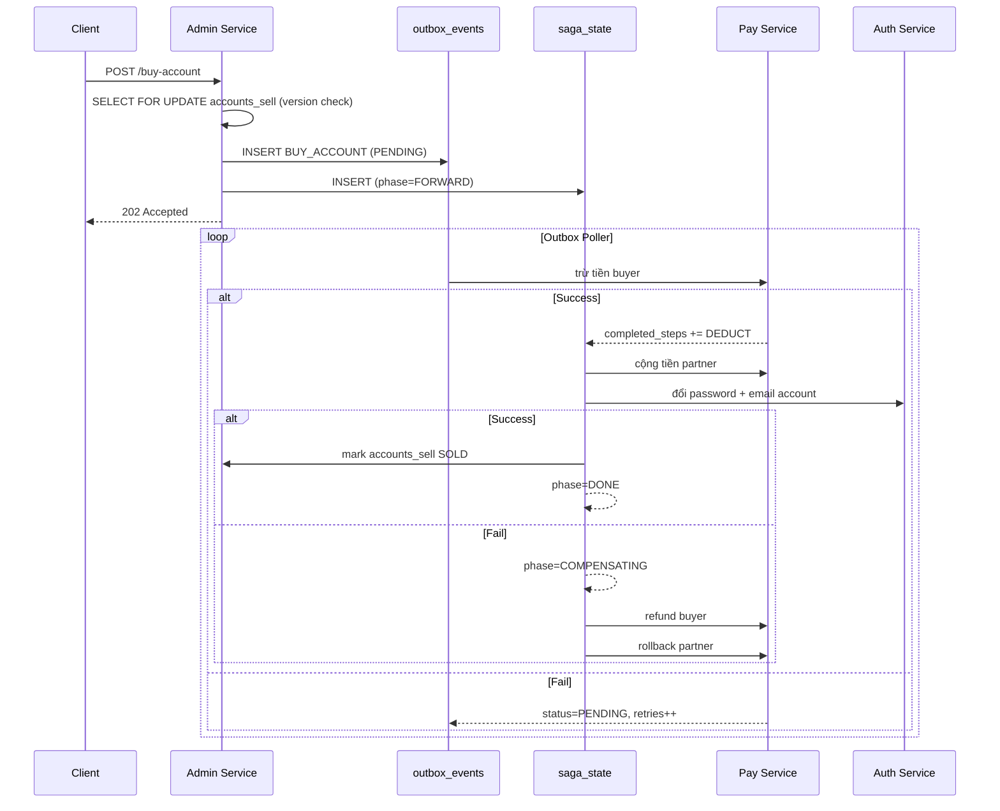
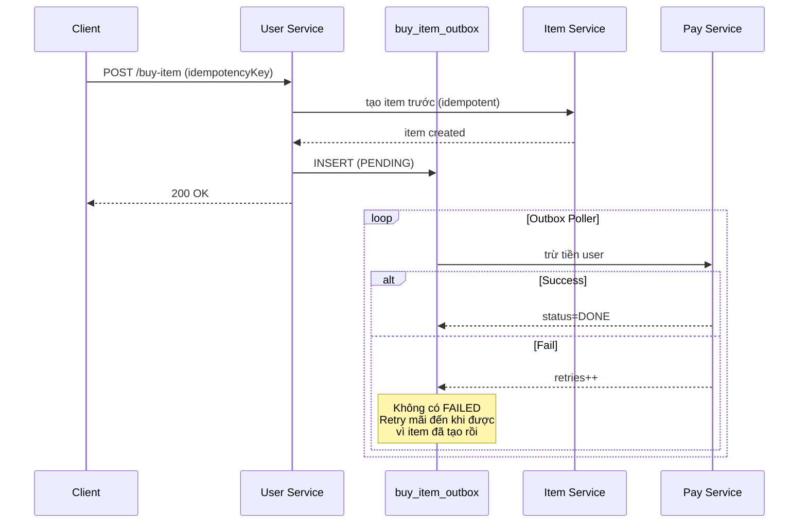

# Dragon Boy - System Architecture

Tài liệu mô tả kiến trúc tổng thể của hệ thống Dragon Boy - game online dạng microservice.

## 1. Tổng quan kiến trúc

Hệ thống được xây dựng theo kiến trúc microservice với pattern **database-per-service**. Mỗi service sở hữu DB riêng và giao tiếp với nhau qua HTTP (sync) hoặc Outbox/Saga pattern (async).

### Stack chính

- **Backend**: NestJS + TypeORM
- **Database**:
  - MySQL InnoDB: auth, user, item, pay, social, detu, game-data
  - PostgreSQL: admin (vì cần `jsonb` cho saga payload)
  - MongoDB: logger
- **Patterns**: Saga, Outbox, Idempotency Key, Optimistic Lock

### Service relationship



**Quy ước:**
- Mũi tên liền `-->`: sync HTTP call
- Mũi tên đứt `-.->`: async qua Outbox/Saga pattern

## 2. ERD tổng thể toàn hệ thống

ERD bên dưới hiển thị **toàn bộ entity** của hệ thống, kèm theo cả physical FK (trong cùng DB) lẫn logical FK (xuyên service).

> ⚠️ **Lưu ý quan trọng**: Quan hệ giữa các service là **logical FK** - chỉ tồn tại ở tầng application, không có constraint vật lý ở DB. Tool reverse-engineering sẽ không detect được các quan hệ này.

```mermaid
erDiagram
    %% ========== AUTH SERVICE (MySQL) ==========
    AUTH ||--o{ REGISTER_OUTBOX : "saga register"

    AUTH {
        int id PK
        string username UK
        string email
        string realname
        boolean biBan
        string role "USER/ADMIN/EDITOR/PARTNER"
        int tokenVersion
        string password
        string avatarUrl
        int type "0=normal 1=google"
        timestamp createdAt
        timestamp updatedAt
    }
    REGISTER_OUTBOX {
        uuid id PK
        json payload
        string status "PENDING/PROCESSING/DONE/FAILED"
        int retries
        int maxRetries
        datetime nextRetryAt
        text lastError
    }
    AUTH_IDEMPOTENCY {
        string key PK
        json response
        datetime expires_at
    }

    %% ========== USER SERVICE (MySQL) ==========
    USERS ||--|| USER_GAME_STATS : "1-1"
    USERS ||--|| USERS_POSITION : "1-1"
    USERS ||--o{ USERS_WEB_ITEM : "1-n"

    USERS {
        int id PK
        bigint auth_id UK "logical FK AUTH.id"
        string gameName
        string avatarUrl "duplicated from AUTH"
        timestamp createdAt
        timestamp updatedAt
    }
    USER_GAME_STATS {
        int id PK
        int userId FK
        bigint vang "indexed leaderboard"
        bigint ngoc
        bigint sucManh "indexed leaderboard"
        bigint vangNapTuWeb
        bigint ngocNapTuWeb
        boolean daVaoTaiKhoanLanDau
        boolean coDeTu
    }
    USERS_POSITION {
        int id PK
        int userId FK
        float x
        float y
        string mapHienTai
    }
    USERS_WEB_ITEM {
        int id PK
        int userId FK
        bigint item_id "logical FK ITEMS"
        bigint price
        timestamp createdAt
    }
    BUY_ITEM_OUTBOX {
        int id PK
        json payload
        string status
        int retries
        datetime nextRetryAt
    }
    CREATE_PAY_OUTBOX {
        uuid id PK
        json payload
        string status
        int retries
        datetime nextRetryAt
    }

    %% ========== DETU SERVICE (MySQL) ==========
    DETU {
        int id PK
        bigint sucManh "default 2000"
        int userId "logical FK USERS.id"
    }

    %% ========== ITEM SERVICE (MySQL) ==========
    ITEMS {
        int id PK
        string maItem
        string ten
        string loai
        text moTa
        int soLuong
        string hanhTinh
        string setKichHoat
        int soSaoPhaLe
        int soSaoPhaLeCuongHoa
        int soCap
        float hanSuDung
        string sucManhYeuCau
        string linkTexture
        string viTri
        text chiso "JSON string"
        int userId "indexed logical FK USERS"
        string uuid
    }

    %% ========== PAY SERVICE (MySQL) ==========
    PAY ||..o{ CASH_FLOW_MANAGEMENT : "lịch sử"

    PAY {
        int id PK
        string tien "default 0"
        int userId UK "logical FK USERS"
        string status "open/closed"
        timestamp updatedAt
    }
    CASH_FLOW_MANAGEMENT {
        int id PK
        int userId "indexed logical FK"
        string type "NAP/RUT"
        int amount
        timestamp create_at
    }
    PAY_IDEMPOTENCY {
        string key PK
        json response
        datetime expires_at
    }

    %% ========== SOCIAL SERVICE (MySQL) ==========
    CHAT_GROUPS ||--o{ CHAT_GROUP_MEMBERS : "có thành viên"
    COMMENTS ||..o{ COMMENT_LIKES : "logical"
    COMMENTS ||..o{ COMMENTS : "parent-child"

    CHAT {
        int id PK
        string roomId "composite idx with createdAt"
        int userId "logical FK"
        longtext content
        timestamp createdAt
    }
    CHAT_GROUPS {
        int id PK
        string name
        string avatarUrl
        string description
        int ownerId "logical FK USERS"
        int maxMember "default 500"
        timestamp createdAt
    }
    CHAT_GROUP_MEMBERS {
        int id PK
        int groupId FK
        int userId "indexed logical FK"
        int role
        timestamp joinedAt
    }
    COMMENTS {
        int id PK
        int postId "indexed logical FK POSTS"
        int parentId "self-ref"
        int userId "logical FK"
        int likeCount "denormalized"
        boolean isDelete "soft delete"
        string content
        timestamp createdAt
    }
    COMMENT_LIKES {
        int id PK
        int commentId "logical FK"
        int userId "logical FK"
        timestamp createdAt
    }
    NOTIFICATION {
        int id PK
        int userId "indexed logical FK"
        string title
        longtext content
        timestamp createdAt
    }
    SOCIAL_NETWORK {
        int id PK
        int userId "logical FK"
        int friendId "logical FK"
        int status "0=pending 1=accepted 2=blocked"
        timestamp createdAt
    }

    %% ========== ADMIN SERVICE (PostgreSQL) ==========
    ACCOUNTS_SELL ||..o{ OUTBOX_EVENTS : "BUY_ACCOUNT saga"
    OUTBOX_EVENTS ||..|| SAGA_STATE : "tracks progress"

    WITHDRAW_MONEY {
        int id PK
        int userId "indexed logical FK AUTH"
        int amount
        string bank_name
        string bank_number
        string bank_owner
        string status "PENDING/SUCCESS/ERROR"
        int finance_id "admin duyệt"
        timestamp request_at
        timestamp success_at
    }
    POSTS {
        int id PK
        string title
        string url_anh
        text content
        int editor_id "indexed logical FK AUTH"
        string editor_realname "duplicated"
        string status "ACTIVE/LOCKED"
        timestamp create_at
        timestamp update_at
    }
    ACCOUNTS_SELL {
        int id PK
        string username
        string password
        string url
        string description
        int price
        string status "SOLD/ACTIVE"
        int partner_id "logical FK AUTH"
        int buyer_id "logical FK AUTH"
        int version "optimistic lock"
        timestamp createdAt
    }
    OUTBOX_EVENTS {
        uuid id PK
        string sagaType "BUY_ACCOUNT"
        jsonb payload
        string status
        int retries
        int maxRetries
        timestamp nextRetryAt
        text lastError
    }
    SAGA_STATE {
        uuid saga_id PK
        enum phase "FORWARD/COMPENSATING/DONE/FAILED"
        int attempt
        jsonb completed_steps
        text original_password
        text original_email
    }

    %% ========== GAME-DATA SERVICE (MySQL - master data) ==========
    MAP_BASE ||--o{ NPC_SPAWN : "có spawn"
    NPC_BASE ||--o{ NPC_SPAWN : "được spawn"
    NPC_BASE ||--o{ NPC_SHOP_ITEM : "shop của NPC"
    ITEM_BASE ||--o{ NPC_SHOP_ITEM : "item bán"

    MAP_BASE {
        int id PK
        string ten UK
    }
    NPC_BASE {
        int id PK
        string ten UK
        enum loai "NGUOI/CAYDAU/RUONGDO/DUIGA"
    }
    ITEM_BASE {
        int id PK
        string ten UK
        string ma UK
    }
    NPC_SPAWN {
        int id PK
        int npc_base_id FK
        int map_id FK
        float x
        float y
        boolean is_active
    }
    NPC_SHOP_ITEM {
        int id PK
        int npc_base_id FK
        int item_base_id FK
        int gia
        enum loaiTien "VANG/NGOC"
        enum tab "AO_QUAN/PHU_KIEN/DAC_BIET"
        boolean is_active
    }

    %% ========== LOGICAL FK XUYÊN SERVICE ==========
    AUTH ||..|| USERS : "logical 1-1"
    USERS ||..|| DETU : "logical 1-1"
    USERS ||..o{ ITEMS : "logical 1-n"
    USERS ||..|| PAY : "logical 1-1"
    USERS ||..o{ CHAT : "logical chat"
    USERS ||..o{ CHAT_GROUPS : "owner"
    USERS ||..o{ CHAT_GROUP_MEMBERS : "member"
    USERS ||..o{ COMMENTS : "viết comment"
    USERS ||..o{ NOTIFICATION : "nhận noti"
    USERS ||..o{ SOCIAL_NETWORK : "friend"
    AUTH ||..o{ WITHDRAW_MONEY : "rút tiền"
    AUTH ||..o{ POSTS : "editor viết"
    AUTH ||..o{ ACCOUNTS_SELL : "partner bán"
    POSTS ||..o{ COMMENTS : "logical bài viết"
    ITEMS ||..o{ USERS_WEB_ITEM : "logical mua web"
```



### Quy ước trong ERD

| Ký hiệu | Ý nghĩa |
|---------|---------|
| `||--o{` | Quan hệ 1-n có physical FK (cùng DB) |
| `||--\|\|` | Quan hệ 1-1 có physical FK |
| `\|\|..o{` | Quan hệ 1-n logical (xuyên service, không có FK vật lý) |
| `\|\|..\|\|` | Quan hệ 1-1 logical (xuyên service) |

## 3. Service breakdown

### 3.1. Auth Service (MySQL)

Quản lý xác thực, phân quyền, đăng ký/đăng nhập.

**Entities**: `AUTH`, `REGISTER_OUTBOX`, `AUTH_IDEMPOTENCY`

**Đặc điểm:**
- Là source of truth cho `username`, `email`, `password`, `role`
- `tokenVersion` dùng để invalidate JWT khi đổi password/ban user
- `type` phân biệt login thường (0) vs Google OAuth (1)
- Có Outbox pattern cho register saga (tạo user ở user-service sau khi auth thành công)

### 3.2. User Service (MySQL)

Quản lý dữ liệu game của người chơi: stats, vị trí, vật phẩm web.

**Entities**: `USERS`, `USER_GAME_STATS`, `USERS_POSITION`, `USERS_WEB_ITEM`, `BUY_ITEM_OUTBOX`, `CREATE_PAY_OUTBOX`

**Đặc điểm:**
- `auth_id` là logical FK đến `AUTH.id`
- Chấp nhận **data duplication** với auth (avatarUrl) để giảm latency và phụ thuộc network
- Eventual consistency qua event-driven
- Index trên `vang`, `sucManh` cho leaderboard query (`ORDER BY ... LIMIT N`)
- Có 2 outbox: `BUY_ITEM_OUTBOX` (mua item) và `CREATE_PAY_OUTBOX` (tạo ví khi register)

### 3.3. Đệ Tử Service (MySQL)

Service nhỏ quản lý đệ tử của user.

**Entities**: `DETU`

**Đặc điểm:**
- 1 user có 1 đệ tử (logical 1-1 qua `userId`)
- Tách thành service riêng để tách concern game logic, dễ scale độc lập

### 3.4. Item Service (MySQL)

Quản lý vật phẩm trong inventory của user.

**Entities**: `ITEMS`

**Đặc điểm:**
- `chiso` lưu dạng JSON string (flexibility cho stat đa dạng)
- Index trên `userId` cho query inventory (critical path khi vào game)
- Business hiện tại: AddMultiple = delete + insert lại → trade-off chấp nhận được vì InnoDB Change Buffer hấp thụ tốt

### 3.5. Pay Service (MySQL)

Quản lý ví và lịch sử dòng tiền.

**Entities**: `PAY`, `CASH_FLOW_MANAGEMENT`, `PAY_IDEMPOTENCY`

**Đặc điểm:**
- 1 user có 1 ví (`PAY.userId` UK)
- `CASH_FLOW_MANAGEMENT` lưu lịch sử nạp/rút (event sourcing nhẹ)
- Idempotency key tránh trừ tiền 2 lần khi network retry

### 3.6. Social Service (MySQL)

Quản lý chat, comment, friend, notification.

**Entities**: `CHAT`, `CHAT_GROUPS`, `CHAT_GROUP_MEMBERS`, `COMMENTS`, `COMMENT_LIKES`, `NOTIFICATION`, `SOCIAL_NETWORK`

**Đặc điểm:**
- `CHAT_GROUPS → CHAT_GROUP_MEMBERS` là physical FK với CASCADE
- Composite index `(roomId, createdAt)` cho chat history
- Composite index `(userId, status)` và `(friendId, status)` cho friend queries
- `likeCount` denormalize trong COMMENTS để tránh `COUNT(*)` mỗi lần load
- `isDelete` soft delete cho comment

### 3.7. Admin Service (PostgreSQL)

Quản lý nghiệp vụ admin: rút tiền, bài viết, mua bán account.

**Entities**: `WITHDRAW_MONEY`, `POSTS`, `ACCOUNTS_SELL`, `OUTBOX_EVENTS`, `SAGA_STATE`

**Đặc điểm:**
- Dùng PostgreSQL vì cần `jsonb` cho saga payload (query/index field bên trong JSON tốt hơn MySQL JSON)
- `ACCOUNTS_SELL.version` dùng optimistic lock tránh 2 user mua cùng 1 account
- Saga `BUY_ACCOUNT`: trừ tiền buyer → cộng tiền partner → đổi password account → mark SOLD

### 3.8. Game Data Service (MySQL)

Master data của game: map, NPC, item base, shop config.

**Entities**: `MAP_BASE`, `NPC_BASE`, `ITEM_BASE`, `NPC_SPAWN`, `NPC_SHOP_ITEM`

**Đặc điểm:**
- Là service duy nhất có **physical FK đầy đủ** vì master data nằm cùng DB
- Read-heavy, write rất ít (chỉ admin/dev update)
- Có thể cache aggressive ở application layer

### 3.9. Logger Service (MongoDB)

Log tập trung từ tất cả service.

**Schema document:**

```
{
  _id: ObjectId,
  timestamp: Date,    // indexed
  status: String,     // INFO/WARN/ERROR/DEBUG
  service: String,    // tên service phát log
  message: String,
  metadata?: Object
}
```

**Đặc điểm:**
- Dùng MongoDB vì schema linh hoạt, ghi nhanh, query theo thời gian dễ
- TTL index để tự xóa log cũ (ví dụ giữ 30 ngày)

## 4. Distributed transaction patterns

### 4.1. Saga: Register flow



### 4.2. Saga: Buy Account (admin service)



### 4.3. Saga: Buy Item



## 5. Index strategy

Tổng hợp các index quan trọng và lý do:

| Service | Bảng | Index | Lý do |
|---------|------|-------|-------|
| Auth | `auth` | `username` (UK) | Login query |
| User | `user_game_stats` | `vang`, `sucManh` | Leaderboard `ORDER BY ... LIMIT N` |
| Item | `items` | `userId` | Load inventory khi vào game |
| Social | `chat` | `(roomId, createdAt)` | Chat history sort |
| Social | `social_network` | `(userId, status)`, `(friendId, status)` | Friend list filter pending |
| Social | `chat_group_members` | `(groupId, userId)` UK + `userId` riêng | Cover cả 2 chiều query |
| Admin | `outbox_events` | `(status, nextRetryAt)` | Outbox poller |
| Admin | `outbox_events` | `(status, updatedAt)` | Cleanup job |
| Admin | `accounts_sell` | `partner_id`, `buyer_id` | Filter theo người bán/mua |
| Pay | `cash_flow_management` | `userId` | Lịch sử user |

### Nguyên tắc đánh index

1. **Composite index theo thứ tự selectivity → ORDER BY**
   - VD: `(status, nextRetryAt)` đặt status trước vì filter equality, nextRetryAt sau vì range scan

2. **Status có selectivity thấp vẫn đáng index nếu popularity của value cần query thấp**
   - VD: outbox `status='PENDING'` chiếm < 1% sau thời gian chạy → vẫn lọc được phần lớn rows

3. **Unique index cover được leftmost prefix queries**
   - VD: `UK(groupId, userId)` cover query chỉ filter `groupId`

4. **InnoDB tự đánh index cho FK** → không cần `@Index()` thủ công cho cột relation

## 6. Trade-offs đã chấp nhận

### Data duplication
- `avatarUrl` duplicated giữa `AUTH` và `USERS` → tránh phải gọi cross-service mỗi khi cần avatar
- `editor_realname` duplicated trong `POSTS` → tránh JOIN cross-service khi hiển thị bài viết
- **Cost**: phải sync khi update qua event

### Eventual consistency
- Register flow: user record có thể tạo trễ vài giây sau khi auth tạo
- Buy item: tiền có thể trừ trễ sau khi item đã có trong inventory
- **Cost**: phải handle UI loading state, idempotency

### Logical FK thay vì physical
- Không có FOREIGN KEY constraint xuyên service
- **Cost**: không có DB-level integrity, phải validate ở application layer

### Outbox thay vì 2PC
- Không dùng distributed transaction
- **Benefit**: service autonomy, performance tốt hơn
- **Cost**: code phức tạp hơn, cần handle retry/compensation

## 7. Roadmap mở rộng

Một số hướng có thể cải thiện trong tương lai:

- **Event bus**: hiện tại các service gọi nhau qua HTTP + Outbox poller. Có thể chuyển sang Kafka/RabbitMQ để decouple hơn
- **CQRS**: tách read model riêng cho leaderboard (Redis sorted set) thay vì query DB mỗi lần
- **Cache layer**: Redis cache cho game-data (master data), user session
- **Service mesh**: Istio/Linkerd cho observability, retry policy, circuit breaker tự động
- **Schema registry**: nếu chuyển sang event-driven, cần Avro/Protobuf schema để versioning

---

*Tài liệu này nên được update mỗi khi có thay đổi lớn về schema hoặc service boundary.*